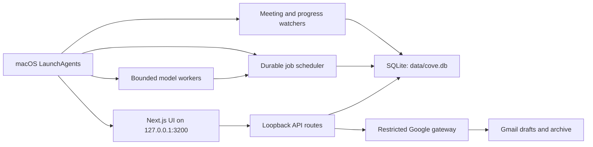

# Cove Architecture

Cove is a local-first, single-operator command center. Its north star is to show the operator what matters now, let AI prepare useful work, and never hide uncertainty or take an irreversible action without a clear boundary.

## System shape

## Trust boundaries

- SQLite is the durable application source of truth. UI optimism is temporary and must roll back when persistence fails.
- Gmail remains the email source of truth. Cove's gateway code exposes read, draft creation, narrow label changes, and archive operations, with no send operation. The `gmail.modify` scope is the narrowest Google scope that still permits drafts and archiving, and it does not permit permanent deletion. The no-send guarantee is enforced by Cove's code, not by the credential.
- Model output is a proposal. Deterministic code validates schemas, task IDs, evidence references, state versions, and allowed operations before persistence.
- Background work uses durable jobs, idempotency keys, leases, bounded retries, receipts, and an Issues inbox.
- Model subprocesses receive explicit tools, isolated settings and MCP configuration, a minimal environment, a spend ceiling, and a wall-clock deadline.

## Product domains

| Domain | Primary code | Durable state |
| --- | --- | --- |
| Tasks and Quiet Current | `src/components/tasks`, `src/lib/day-plan`, `src/lib/quiet-current` | tasks, day plans, ritual decisions |
| Morning Brief | `src/lib/day-plan/brief*`, `src/lib/claude-execution/worker.ts` | immutable brief artifacts and exact input manifests |
| Email | `src/lib/email`, `scripts/cove-email-runner.ts` | thread ledger, Gmail operation outbox, receipts |
| Meetings and progress | `src/lib/intake`, meeting and progress scripts | tasks, digests, relays, heartbeats |
| Reliability | `src/lib/reliability`, `src/lib/health` | jobs, receipts, failures, backups, readiness |
| Google Workspace | `src/lib/workspace` | non-secret local config plus secrets in macOS Keychain |

For a file-level ownership map, request traces, and test seams, see
`CODEBASE_GUIDE.md`.

## Process boundaries

Cove has three kinds of process, each with different authority:

1. The loopback web process serves UI and API requests. It may make validated
   synchronous product changes.
2. Scheduled deterministic scripts observe time or provider state and enqueue
   or complete bounded work.
3. Model workers receive a narrow context envelope and return a proposal. They
   do not receive an ambient shell, an unrestricted MCP configuration, or a
   direct database or provider write path.

The durable queue sits between a request and background model work. Claims,
leases, retries, and receipts survive a worker restart. A process exit code is
never treated as proof that the intended product effect occurred.

## Read and write paths

Browser components call typed adapters in `src/lib/data`, which call local API
routes. Routes authorize and validate input, then call domain modules in
`src/lib`. Server modules own SQLite access and outside effects. React state may
optimistically reflect a change, but it must reconcile or roll back against the
server result.

Background scripts use the same domain modules where possible. They do not
create an alternate schema or write ad hoc JSON when a durable database owner
already exists.

## Supported deployment

The supported product is one Mac, one operator, local SQLite, and a localhost-only web process. Old Forge names, Supabase branches, relays, and retired multi-machine notes are migration history, not the product architecture. Compatibility code must never create a second source of truth.

The meeting and progress LaunchAgent plists are templates under
`scripts/launchd/`; `scripts/install-cove-local.sh` renders the remaining agents
from discovered machine paths and enabled integrations. See the Background
processes table in `CODEBASE_GUIDE.md` for the authoritative labels and
conditions. `--mini` is a separate legacy profile: it installs the Mini brief
agent and the two rendered lane plists, then stops.
