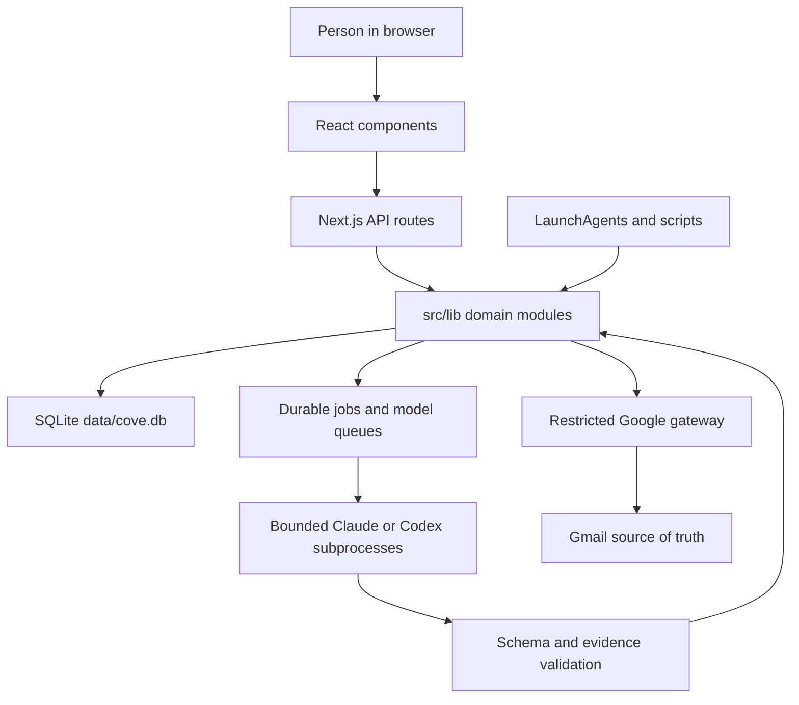

# Cove codebase guide

This is the canonical map for an engineer or coding agent entering Cove for the
first time. It explains where behavior lives, how state moves through the
system, and which invariants must survive a change.

Use this guide to orient yourself. Use the code and tests as the final authority
for exact behavior.

## Read this first

For product or engineering work, read in this order:

1. `AGENTS.md` for machine setup and safety rules.
2. `README.md` for the user-facing product model.
3. This guide for code ownership and data flow.
4. `ARCHITECTURE.md` for system boundaries.
5. `DATA.md` for durable state and retention.
6. `SECURITY_AND_INTEGRATIONS.md` before touching requests, credentials,
   model execution, Gmail, or any external action.
7. `CONFIGURATION.md` and `OPERATIONS.md` for runtime settings and recovery.
8. `SETUP.md` only when changing or testing the first-user install.

The private development repository also has `STATUS.md` and `docs/README.md`.
They contain current work history and an index of design records. They are not
part of the sanitized client repository.

## The product in one paragraph

Cove is a local-first command center for one person on one Mac. The browser UI
runs on loopback. SQLite is the durable application store. Gmail remains the
source of truth for email. Models may interpret bounded context and return
validated proposals, but deterministic Cove code owns persistence and outside
side effects. The default first-day product is the task board, People, Buddy,
Morning Arrival, Close My Day, backups, and local background workers. Optional
integrations are enabled deliberately.

## Repository map

| Path | Responsibility |
| --- | --- |
| `src/app/` | Next.js pages and loopback API route handlers. Routes should parse, authorize, call a domain module, and project a response. |
| `src/components/` | Browser UI. Task ritual, board, Buddy, People, and Issues surfaces live here. Components do not open SQLite directly. |
| `src/lib/` | Product behavior and durable state. This is the main engineering surface. |
| `scripts/` | Background-process entry points, installer, backups, verification, fixtures, and command-line operations. |
| `scripts/launchd/` | LaunchAgent templates rendered by the installer. Templates contain placeholders, not a person's paths. |
| `prompts/` | Owner-authored model mandates. Prompt changes are product changes and need schema, version, and regression review. |
| `.claude/skills/` | Narrow skills invoked by Cove's own model lanes. They return structured data and never write Cove storage directly. |
| `skills/` | User-facing Cove skills installed into Claude and Codex. They are part of the public contract. |
| `tests/` | Node test suite. Most UI behavior is tested through pure presentation and state functions rather than a browser framework. |
| `fixtures/` | Sanitized test fixtures. Never put live mail, tasks, contacts, credentials, or transcripts here. |
| `data/` | Runtime-private state plus a few allowlisted examples. Live files are gitignored and excluded from client exports. |
| `convex/` | Retired cloud-runtime compatibility. It is not part of the supported single-Mac product. Do not add new product behavior here. |
| `buddy/` | Sandbox and permission templates for Buddy's Claude sessions. |
| `public/` | Static browser assets. |

## System flow at a glance

The arrows into SQLite and Google are controlled by Cove code. A model response
never becomes a database write or provider action merely because it was valid
JSON.

## Primary browser surfaces

| Surface | Page | Main component | Main domain modules |
| --- | --- | --- | --- |
| Today and All Work | `src/app/tasks/page.tsx` | `src/components/tasks/TaskWorkspace.tsx`, `TodayView.tsx`, `KanbanBoard.tsx` | `src/lib/day-plan/`, `src/lib/data/tasks.ts`, `src/lib/tasks/` |
| People | `src/app/crm/page.tsx` | `src/components/crm/CRMView.tsx`, `LocalCRMView.tsx` | `src/lib/crm/`, `src/lib/data/crm.ts` |
| Sales pipeline | `src/app/crm/pipeline/page.tsx` | `src/components/crm/PipelineView.tsx` | `src/lib/crm/pipeline.ts`, `pipeline-store.ts`, `src/lib/data/crm.ts` |
| Buddy | Mounted from the root layout | `src/components/buddy/BuddyProvider.tsx`, `BuddyDock.tsx` | `src/lib/buddy/`, `/api/buddy/*` |
| Issues | `src/app/failures/page.tsx` | `src/components/reliability/FailureInbox.tsx` | `src/lib/reliability/failures.ts` |
| Guide | `src/app/guide/page.tsx` | Page-local presentation | User education only |

`TodayView.tsx` is the browser coordinator for tasks, Quiet Current, recurring
work, the day ritual, and task sessions. Keep durable rules in `src/lib/` and
keep pure display decisions in presentation modules. Do not move persistence
or security decisions into React state.

## API routes

Every route is a local HTTP boundary even though the product runs on one Mac.
Treat request bodies, query strings, headers, and stored model text as untrusted.

| Route group | Responsibility | Domain owner |
| --- | --- | --- |
| `/api/cove-rest/[table]` | Narrow PostgREST-like table access for allowlisted product tables | `src/lib/local/db.ts`, `src/lib/data/cove-tables.ts` |
| `/api/day-plan` | Ensure, read, mutate, start, settle, and repair the daily ritual | `src/lib/day-plan/store.ts` |
| `/api/day-plan/assistant-apply` | Validate and apply a Buddy replan preview | `src/lib/day-plan/assistant-patch.ts` |
| `/api/day-plan/execution` | Older bounded day-plan execution lane | `src/lib/claude-execution/` |
| `/api/task-session-runs` | Interactive Claude task sessions opened by owner chips | `src/lib/task-sessions/manager.ts` |
| `/api/quiet-current` | Pencil suggestions, decisions, and returns | `src/lib/quiet-current/` |
| `/api/buddy/turn` | Stream a Buddy turn and reconcile receipts | `src/lib/buddy/stream.ts`, `src/lib/buddy/store.ts` |
| `/api/buddy/session` | Read or reset the continuous Buddy session | `src/lib/buddy/store.ts` |
| `/api/buddy/spawn-session` | Open a new user-visible Claude session in an allowed directory | `src/lib/buddy/spawn-session.ts` |
| `/api/buddy/confirm-delete` | Mint a confirmation token against a visible pending delete | `src/lib/buddy/store.ts` |
| `/api/buddy/confirm-delete/consume` | Consume the exact single-use delete token | `src/lib/buddy/store.ts` |
| `/api/crm` | Local contact identity, updates, and activities | `src/lib/crm/` |
| `/api/crm/attio` | Retired-runtime Attio read compatibility | `src/lib/data/attio-crm.ts` |
| `/api/email/automation` | User-confirmed email card actions | `src/lib/email/automation.ts` |
| `/api/recurrence` | Recurring template confirmation and lifecycle | `src/lib/tasks/recurrence.ts` |
| `/api/failures` | Visible failure inbox | `src/lib/reliability/failures.ts` |
| `/api/health` | Read-only readiness and latest health snapshot | `src/lib/health/` |
| `/api/task-settings` | Local focus-seat and stale-task settings | `src/lib/tasks/settings.ts` |

Before adding a route, look at `src/lib/request-security.ts` and a sibling route.
Reads need the trusted local request boundary. Mutations also need the Cove CSRF
token. A trusted Host header is DNS-rebinding defense, not user authentication.

## Domain map

### Day plan and Morning Brief

`src/lib/day-plan/` is the center of Cove's daily ritual.

| File or group | Role |
| --- | --- |
| `store.ts` | Durable state machine for plan creation, Arrival, start, settlement, execution state, snapshots, and repair. This is the source of truth. |
| `types.ts` | Shared domain types and mutation vocabulary. |
| `store-errors.ts` | Typed conflict, transition, and not-found errors used by routes. |
| `candidates.ts` | Deterministic task selection before model ranking. |
| `presentation.ts` | Pure read-model and UI decisions. Prefer adding testable display rules here. |
| `brief.ts` | Brief artifact schema, validation, hashing, storage shape, and public types. |
| `brief-sources.ts` | Collects, normalizes, labels, and bounds every brief source. |
| `brief-view.ts` | Rehydrates model-selected task IDs against current deterministic candidates. |
| `brief-triggers.ts`, `brief-gate.ts` | Dedupe and eligibility decisions for generation. |
| `brief-relay.ts` | Historical cross-machine transport plus import compatibility. Single-Mac operation does not need a relay. |
| `assistant-patch.ts` | Validates the limited replan operation vocabulary. |
| `reconciliation.ts` | Compares task state with a plan without trusting stale browser state. |
| `execution-readiness.ts`, `public-execution.ts` | Authorization and safe projection for the older execution lane. |
| `weekday.ts` | Pure working-day helpers safe for client imports. |

Day-plan writes are optimistic-concurrency controlled. The browser sends an
expected version and a mutation ID. The store validates the transition, writes
state and ledger evidence together, then returns the new read model. A conflict
must be shown or retried from a fresh read. Never silently apply an old intent
to a newer plan.

Morning Brief flow:

1. `brief-sources.ts` collects required and optional evidence with explicit
   freshness and size limits.
2. `brief.ts` builds a canonical input envelope and hash.
3. `src/lib/claude-execution/brief-commands.ts` and
   `prompts/chief-of-staff.md` build the model request.
4. `worker.ts` runs a bounded, tool-free model subprocess.
5. Deterministic validators check the entire nested response and evidence refs.
6. An immutable artifact is stored.
7. `brief-view.ts` rehydrates selected task IDs against the live board before
   the store overlays rationale onto the plan.

A brief may rank and explain. It is not evidence that a task exists or is done.
If generation fails, Morning Arrival must remain usable.

### Local database and migrations

`src/lib/local/database.ts` opens SQLite and defines the connection settings.
`src/lib/local/migrations.ts` is the general ordered schema history.
`src/lib/local/db.ts` implements the allowlisted REST query subset.

Day-plan storage has a second migration list, `DAY_PLAN_MIGRATIONS`, inside
`src/lib/day-plan/store.ts`. Those migrations currently use versions 100 to 107
and share the same `cove_schema_migrations` ledger as the general list. Preserve
the established 100+ day-plan range. A `day_plans`, `day_plan_items`, brief,
dump, or execution schema change must run through the day-plan store's open path,
so adding it only to `src/lib/local/migrations.ts` is not sufficient.

Use `openSqliteDatabase` when the caller deliberately controls migration timing,
such as migration code or low-level recovery. Use `openLocalDatabase` for normal
product code because it applies pending migrations first.

Migration rules:

- Versions are append-only and strictly increasing.
- A migration must work on both a fresh database and an existing supported one.
- Do not edit an applied migration to change history. Add a new migration.
- Keep destructive table rebuilds explicit and covered by migration tests.
- Preserve foreign-key and transaction assumptions documented by the migration.
- Update `DATA.md` when a new durable state family or retention rule is added.

### Reliability

`src/lib/reliability/` provides four separate records:

- jobs: durable work, leases, retries, and dead-job state;
- receipts: what an automated path actually did;
- failures: work needing operator attention;
- notifications: bounded hard-failure alerts.

Do not collapse these concepts. A receipt is not a job, and a process exit code
is not proof that the intended outside effect happened. Idempotency keys belong
at the durable action boundary.

### Model execution

`src/lib/claude-execution/` owns bounded background model work.

- `worker.ts` claims durable work, supervises child process groups, validates
  outputs, records completion, and recovers stale children.
- `src/lib/claude-execution/commands.ts`, `brief-commands.ts`, and
  `dump-commands.ts` define exact argv, prompts, schemas, and output parsing.
- `morning-brief-writer.ts` contains the Claude and Codex writer adapters.
- `child-process-registry.ts` records enough identity to reap only a process
  Cove actually started.
- `brief-inputs.ts` stores bounded private generation evidence for diagnosis.

### Persistent chief of staff

`scripts/cove-chief-of-staff.ts` is the only operator entry point. `enqueue`
adds a durable `chief-of-staff-wake` job and returns immediately. `drain` claims
those jobs one at a time through `JobScheduler`, which provides leases,
heartbeat renewal, bounded retries, and visible dead jobs. Brief, email triage,
and meeting lanes only enqueue. They never run the persistent agent inline.

`src/lib/chief-of-staff/snapshot.ts` builds a fresh 24,000-character desk
snapshot from existing local stores. Every database value is data, never
instructions. `driver.ts` runs one continuing Codex session in a nested,
read-only agent home, validates its structured output, and applies only the
documented action vocabulary. A dedicated `data/chief-of-staff/codex-home/`
provides a minimal config with shell, web, apps, and MCP absent. Its `auth.json`
is a symlink to the operator's live Codex auth file, and its isolated sessions
hold the resumable rollout. The model has no shell, file reads, MCP, network,
or writes. Its only hands are the JSON actions applied by the driver. The
`chief_of_staff_actions` ledger makes each
action intent replay-safe even when Codex changes its action ID on a retry.
Unknown actions, missing records, and pipeline moves to
`lost` or `parked` are rejected and shown in the next snapshot. `pipeline_add`
can create a non-terminal deal for a contact with no deal. Existing deals must
use `pipeline_update` or `pipeline_move`. `notify` is the agent's only path to
Alex's screen. `src/lib/attention/delivery.ts` rechecks the referenced task,
commitment, or deal, allocates from the shared attention ledger, sanitizes its
text, surfaces Quiet Current evidence, calls the shared transport, and finalizes
the ledger row before the action is marked applied. The driver permits one text
attempt per wake, records any later text request as a banner downgrade, and
rejects board-only transport fallbacks so the agent does not mistake them for
an interruption.

The weekly review deliberately uses a fresh, tool-free Claude run. It proposes
mandate lines in a review file and Quiet Current suggestion. It never edits the
mandate itself.

Buddy remains its own user-visible Claude session in this phase. The persistent
chief of staff does not replace Buddy, share Buddy's transcript, or answer in
Buddy's interface.

Every model lane must specify tools, MCP configuration, environment, timeout,
budget, output cap, and validation. Treat model output as untrusted even when
the process exits successfully.

### Interactive task sessions

`src/lib/task-sessions/manager.ts` is distinct from the background worker. It
opens user-visible Claude Code sessions from task owner chips, records the run,
and exposes a safe status projection. Planning and automatic-edit modes are
derived from the chosen owner behavior, not arbitrary client flags.

Task text is fenced as untrusted data. The session may prepare work, but Cove's
standing rules still prohibit sending, publishing, purchasing, signing, or
other final outside actions without the user.

### Email and Google Workspace

The flow is split deliberately:

- `src/lib/workspace/google/` holds authentication and a fixed-capability Google
  gateway.
- `src/lib/email/` holds claims, classification jobs, canonical thread state,
  draft formatting, the Gmail operation outbox, and card reconciliation.
- `src/lib/crm/contact-context.ts` supplies the same bounded relationship record
  to email, meeting analysis, the brief, and Buddy. Meeting summaries have a
  separate rendering budget so general history cannot crowd them out.
- `scripts/cove-email-runner.ts` is the scheduled orchestration entry point.

The model never receives a Google token or Gmail tool. It returns bounded
classification and draft data. Deterministic code may read observed messages,
create at most one in-thread draft, or archive an exact message after durable
state is ready. The gateway has no send method. Gmail still owns message and
thread truth.

Ambiguous contact identity or unavailable Cove records suppresses a reply
draft while preserving the classifier's bucket. A later meeting summary can
move a still-open Cove-owned draft back through `observed` and the existing
classification job. The next version's `upsert_draft` updates the known Gmail
draft only after its stored body hash still matches.

### Intake and meeting notes

`src/lib/intake/` turns chat, voice, email, and meeting evidence into durable
inbound events and then into tasks or suggestions.

- `inbox.ts` is the claim and resolution ledger.
- `run.ts` is the source-to-triage coordinator.
- `meeting-detection.ts` and `meeting-pipeline.ts` recognize and process meeting
  notes.
- `granola-source.ts` polls Granola's read-only REST API, maps one note to the
  shared meeting envelope, and tracks the first complete summary by the stable
  `granola:<note_id>` message ID.
- `task-writer.ts` performs deterministic final task writes and bundling.
- `message-ingestion.ts` provides shared message claim behavior.

The source text and the triage prompt are separate. Source text is always data.
Replays must resolve to the same source ID and must not duplicate work.

The schema and prompt boundary for intake judgments lives in
`src/lib/triage/`. Keep output parsing and validation there instead of teaching
the task writer to trust free-form model prose.

### Quiet Current and Buddy

Quiet Current is the pencil layer. `src/lib/quiet-current/` stores suggestions
and human decisions. Inferred work never becomes a committed task without an
acceptance or a clear work action.

Buddy's server behavior lives in `src/lib/buddy/`. Its data CLI is
`scripts/cove-buddy-data.ts`. Buddy uses receipts to distinguish a model's words
from confirmed writes. Delete confirmation, replan proof, session creation, and
stream parsing are separate modules so each boundary can be tested.

### Tasks and recurrence

`src/lib/tasks/` owns task-specific rules that should not live in the day-plan
state machine:

- column aliases and canonical meaning;
- archive and restore;
- recurring templates and occurrences;
- focus-seat constraints;
- task settings and stale-task detection;
- bounded maintenance.

Recurrence is deterministic. A template plus local date identifies an
occurrence. Model language may propose a cadence, but the user confirms it and
the recurrence module decides which dates occur.

### CRM

`src/lib/crm/identity.ts` normalizes identity. `local.ts` owns local transactions.
`index.ts` selects the configured backend. Email and meeting paths use the same
backend interface so relationship context does not split across stores.

Email is the strongest identity key. A normalized name is weaker. Ambiguity must
be returned to the user rather than resolved by guessing.

Contact merges run through `src/lib/crm/merge.ts`. Pipeline reparenting and CRM
row merging share one SQLite connection and one transaction, so either both
commit or both roll back.

`src/lib/operator-policy.ts` reads the optional private `cove-policy.md` file
and formats the single policy block shared by the five narrow model surfaces.

### Attention and health

`src/lib/attention/` implements the notification ledger, caps, cooldowns,
transport allocation, and shadow-mode model protocols. The deterministic floor
and persistent chief-of-staff judgment share one budget. The retired
`scripts/cove-attention-sweep.mjs` remains only as a compatibility and regression
seam. `data/attention-sweep.json` now controls shadow mode for the agent's
`notify` action.

`src/lib/intake/notification-transport.mjs` is the shared native-notification
command boundary. It keeps message text out of a shell and routes banners
through the local sender built from `scripts/cove-notifier.swift` and
`public/cove-notification-icon.png`. AppleScript is the last-resort fallback if
the installed sender app is unavailable. New banner paths must go through this
boundary so reminders, intake, attention, and worker failures keep one sender
identity.

`src/lib/health/` collects factual readiness. Never report an integration as
healthy merely because configuration exists. Distinguish not configured, waiting
for first run, healthy, stale, and failed.

### Autonomy and progress evidence

`src/lib/autonomy/` owns the opt-in groundwork setting and its bounded check-in
state. Fresh installs default to off. Groundwork may research or draft inside a
task, but it does not grant authority for an outside action.

`src/lib/progress/` owns the write-once progress evidence relay retained for
compatibility and split-host experiments. In the supported single-Mac product,
progress collection still produces suggestions rather than completing tasks.

### Data adapters

`src/lib/data/` is the browser-facing API client layer. It translates HTTP
responses into typed UI data and broadcasts refresh events. It must not contain
server-only filesystem or SQLite imports.

`src/lib/runtime/` and `src/lib/supabase/` retain migration compatibility. Fresh
installs use local mode. New features should be complete in local mode first and
must not create a second source of truth through a legacy adapter.

## Background processes

The installer can render and load these LaunchAgents. The Condition column is
part of the operating contract: a skipped integration does not imply a missing
or broken agent.

| Label | Entry point | Purpose | Condition |
| --- | --- | --- | --- |
| `com.cove.local` | Next.js production server | Loopback web app and API | Default profile |
| `com.cove.claude-worker` | `scripts/cove-claude-worker.ts` | Brief, dump, execution, and inbound queues | Default profile |
| `com.cove.jobs` | `scripts/cove-jobs.ts` | Durable scheduled jobs and health work | Default profile |
| `com.cove.reminders` | `scripts/cove-reminders.mjs` | Due-task notifications and deterministic attention floor | Default profile |
| `com.cove.email-triage` | `scripts/cove-email-triage.sh` | Configured Gmail catch-up and triage schedule | Only when Workspace email is configured |
| `com.cove.meeting-watch` | `scripts/cove-meeting-watch.mjs` | Polls Granola plus configured Gmail meeting-note sources | Only when this Mac claims the meeting lane; the script remains disabled without meeting config |
| `com.cove.meeting-drain` | `scripts/cove-meeting-watch.mjs --drain-only` | Always-on local meeting-analysis job drain | Only when this Mac claims the meeting lane |
| `com.cove.progress` | `scripts/cove-progress-reconcile.mjs` | Read-only project evidence and progress suggestions | Only when this Mac claims the progress lane |
| `com.cove.voice-review` | `scripts/cove-voice-review.mjs` | Weekly draft-outcome and operator-writing review | Only when this Mac claims the voice-review lane; disabled in email settings by default |
| `com.cove.chief-of-staff-drain` | `scripts/cove-chief-of-staff.ts drain --max 3` | Runs queued persistent-agent wakes one at a time | Only when this Mac claims the chief-of-staff lane |
| `com.cove.chief-of-staff-sweep` | `scripts/cove-chief-of-staff.ts enqueue --reason sweep` | Queues attention judgment at 11:30 and 16:00 | Only when this Mac claims the chief-of-staff lane; `data/attention-sweep.json` is the shadow switch |
| `com.cove.chief-of-staff-nightly` | `scripts/cove-chief-of-staff.ts enqueue --reason nightly` | Queues the 21:30 nightly wake | Only when this Mac claims the chief-of-staff lane |
| `com.cove.chief-of-staff-review` | `scripts/cove-chief-of-staff.ts review` | Runs the Sunday fresh-context review | Only when this Mac claims the chief-of-staff lane |
| `com.cove.local.backup` | `scripts/cove-backup.sh` | Daily online SQLite backup | Default profile |
| `com.cove.morning-brief` | `scripts/cove-claude-worker.ts --lane brief` | Scheduled brief generation on a legacy always-on host | `--mini` profile only |

The table covers both installer profiles. The supported default profile does not
install `com.cove.morning-brief`; laptop backfill and post-settlement generation
cover that need. The legacy `--mini` profile installs only the scheduled brief,
meeting, and progress agents, then exits before rendering the default-profile
agents.

On a laptop, timers catch up only when the Mac is awake. The installer is safe
to rerun and replaces Cove-owned plist files after validating paths. Any change
to a long-running worker requires a rebuild when applicable and a restart of the
matching LaunchAgent before live behavior can prove the change.

## State ownership

| State | Authority | Notes |
| --- | --- | --- |
| Tasks, plans, briefs, contacts, jobs, receipts | SQLite | `data/cove.db`; WAL enabled; migrations run at open. |
| Email messages, drafts, sent state, Inbox | Gmail | Cove stores workflow state and exact provider IDs. |
| OAuth refresh token and client secret | macOS Keychain | Never returned to a model or committed. |
| Non-secret integration settings | Ignored files under `data/` | Examples are allowlisted separately. |
| Model inputs and outputs | Bounded local artifacts plus validated DB rows | Sensitive and loopback-private. |
| Browser optimistic state | React state | Temporary. Must reconcile or roll back against server truth. |
| Quiet Current proposals | Local JSON or database-backed store | Pencil until human action. |

## Cross-cutting invariants

These rules are more important than any individual implementation:

1. Explicit user requests may create committed work. Inferred work starts in
   pencil.
2. Models interpret and propose. Deterministic code authorizes and writes.
3. SQLite is the product source of truth. Do not add a parallel cloud store.
4. Gmail is the email source of truth. Do not copy the mailbox into Cove.
5. No Cove path sends email. Drafting and sending are separate authorities.
6. Every automated write needs an idempotency story and an observable result.
7. A failed optional source should degrade honestly. A missing required source
   should stop that model artifact, not the whole daily ritual.
8. Date-only work remains date-only. Do not invent a clock time from storage or
   an estimated duration.
9. Product scheduling and date-only decisions use the operator's configured
   IANA timezone. A host-local operational window must document that exception.
10. Public API projections omit local paths, process IDs, secrets, raw private
    context, and internal model artifacts.
11. A successful subprocess is not proof of a successful product effect.
12. Browser state never outranks a newer durable version.

## How to trace a behavior

### A button changed the wrong task

1. Start at the component event handler in `src/components/tasks/`.
2. Follow the browser adapter in `src/lib/data/`.
3. Find the API route in `src/app/api/`.
4. Follow the mutation into `src/lib/day-plan/store.ts` or `src/lib/local/db.ts`.
5. Check version, mutation ID, and receipt handling.
6. Read the matching store, route, and presentation tests.

### A Morning Brief looks wrong

1. Inspect the artifact's source manifest and writer provenance.
2. Trace the relevant collector in `brief-sources.ts`.
3. Check bounding, freshness, target date, and timezone.
4. Check the mandate and schema in
   `src/lib/claude-execution/brief-commands.ts` and `prompts/`.
5. Check validation and immutable storage in `brief.ts`.
6. Check rehydration in `brief-view.ts` before blaming the UI.

### Email state disagrees with Gmail

1. Identify the Gmail message ID and thread ID.
2. Inspect the canonical email item, message claim, and operation outbox.
3. Trace `state-machine.ts`, `gmail-outbox.ts`, and `automation.ts`.
4. Re-observe Gmail before retrying a mutation.
5. Check Issues and receipts. Never repair the mismatch by sending or deleting.

### A background job did not run

1. Confirm the Mac was awake and the LaunchAgent is loaded.
2. Identify the exact plist and entry script.
3. Inspect the job, heartbeat, failure, and receipt records separately.
4. Check lane ownership only for a legacy or explicitly split setup.
5. Re-run the narrow command once. Do not start a second permanent worker.

## Test map

Tests are named after the domain they protect. Important clusters:

- `day-plan-store`, `day-plan-route`, `day-plan-presentation`: ritual state and
  browser contract.
- `day-plan-brief*`: collection, generation, artifact, relay, and attachment.
- `email-*`, `workspace-google-gateway`: Gmail workflow and restricted gateway.
- `intake-*`, `meeting-*`: source claims, model triage, and task writes.
- `task-session-*`, `claude-worker`: process supervision and safe projections.
- `reliability-*`, `health-*`, `reminder-*`, `attention-*`: background safety.
- `export-client*`, `install-*`, `public-handoff-*`: distributable repository
  and first-user setup contract.
- `new-user-*.regression-*`: defects found in the clean-user simulation.

Run focused tests while iterating. Run `npm run verify` before a release or
client export. `verify` is the complete gate: typecheck, lint, tests, build, and
setup and export contract checks.

## Commenting standard

Comments in Cove should reduce reasoning cost, not repeat syntax.

Add a comment when code enforces:

- an authority or trust boundary;
- a source-of-truth decision;
- an idempotency or crash-recovery rule;
- a timezone or date-only rule;
- a non-obvious ordering constraint;
- a deliberate fail-open or fail-closed choice;
- a compatibility path that must not become a new feature path;
- a product decision that a reasonable refactor might accidentally remove.

Prefer one clear module comment and a few comments at the dangerous seams. Do
not narrate obvious assignments or preserve stale history in code comments.
Historical reasoning belongs in a design record or Git history.

## Change checklist

Before editing:

1. Find the domain owner in this guide.
2. Read the route, domain module, public projection, and tests together.
3. Identify durable state, outside effects, and replay behavior.
4. Check whether the input can contain untrusted model or provider text.

Before declaring done:

1. Add or update the smallest regression test that proves the invariant.
2. Run focused tests, typecheck, and lint for the changed surface.
3. Run `npm run verify` for a release-facing change.
4. Update this guide or the closest root reference doc if ownership, data flow,
   configuration, or an invariant changed.
5. If the public repository changes, build the sanitized export and test that
   exact tree. A clean internal checkout does not prove the client artifact.
